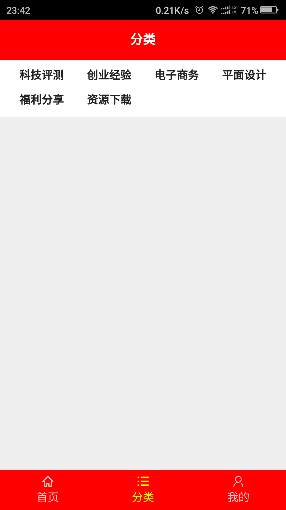
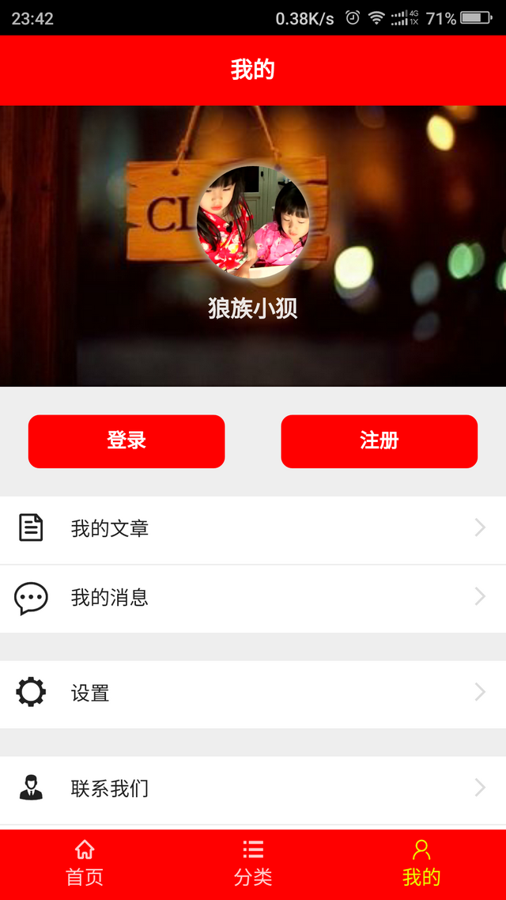
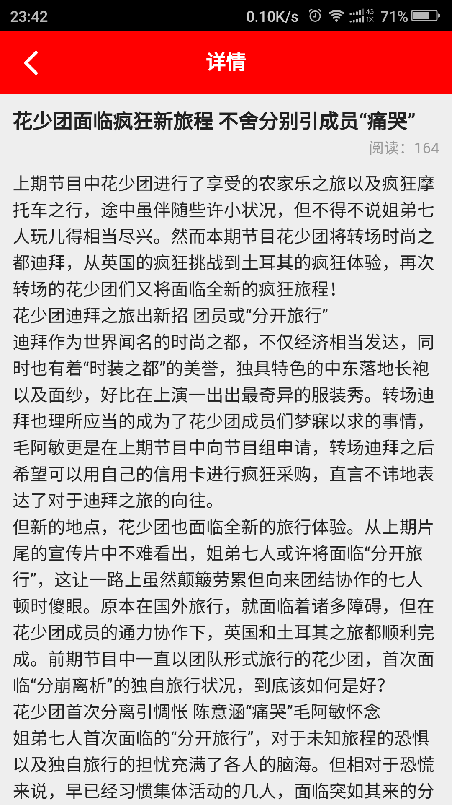
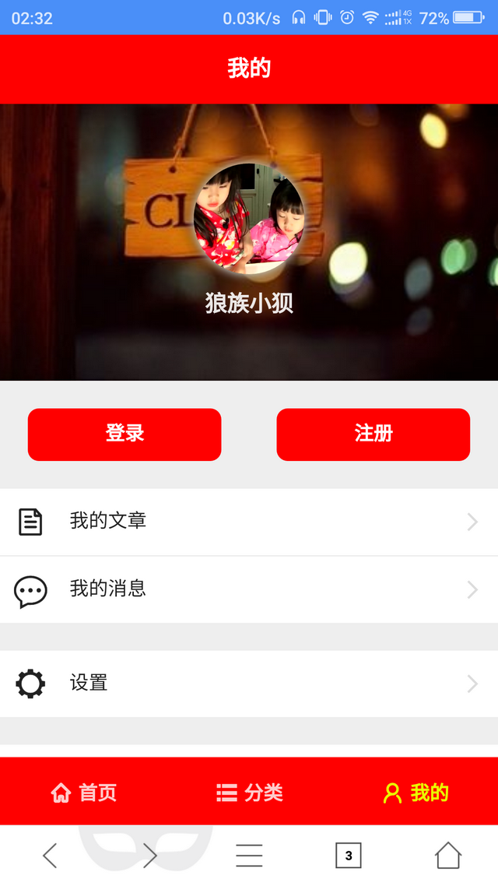
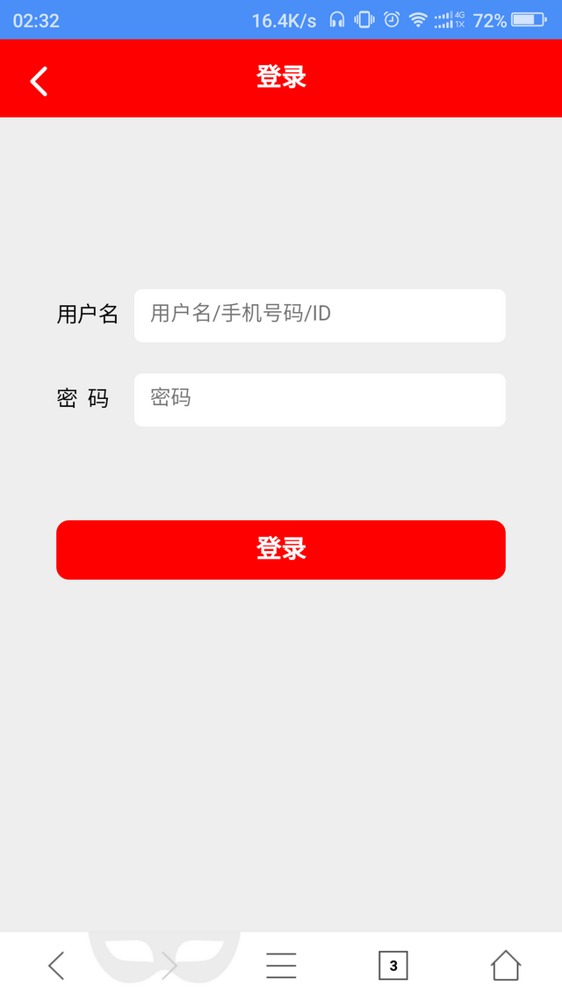

# react-kelink
```
为柯林CMS建站系统定制的文章模块webapp
官网：http://kelink.com/
```
### 广告
```
NodeJS前端分享群 133240225
深圳html5开发者社群 170761660
```
```
技术栈：
1.webpack
2.react
3.react-router
4.ES6
5.less
7.flex-css-layou
8.redux
```
### 编译流程
```
1.安装nodejs环境：https://nodejs.org/en/
2.打开cmd命令，移动到项目目录
3.执行cmd命令安装依赖模块： npm install 
4.运行服务器：npm start 
5.发布应用：webpack -p （注：首次使用webpack请先执行：npm install -g webpack）
6.修改代码自动编译：npm -w
7.浏览器访问：http://localhost:3000/
```

演示地址：http://meirongwu.cn/webapp.html

### 截图











